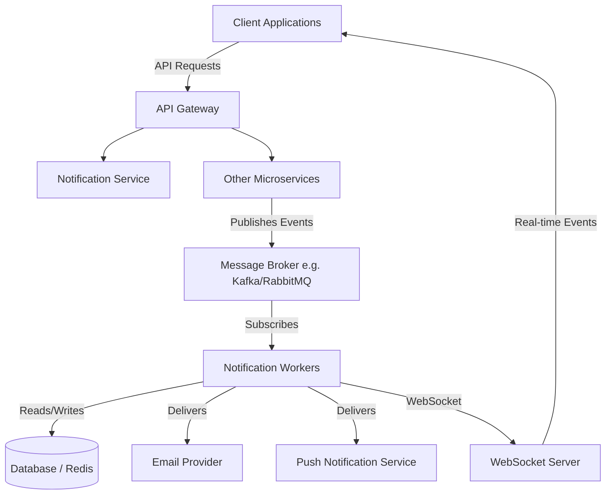

# Notification System Design

## 1. System Overview
The Notification System is designed to provide real-time updates and notifications across the application ecosystem. It acts as a centralized service that processes events from various services and delivers notifications to end-users via multiple channels (e.g., in-app, email, push notifications).

## 2. Architecture Diagram

## 3. Core Components

- **API Gateway**: Entry point for clients to fetch notification history or mark them as read.
- **Message Broker**: Decouples the notification generation from the delivery. Services publish events here.
- **Notification Workers**: Consumers that process events, apply user preferences, and format the messages.
- **Database**: Stores user preferences, notification history, and status (read/unread).
- **WebSocket Server**: Maintains persistent connections with active clients for real-time delivery.

## 4. Technologies
- **Backend Framework**: Node.js / Express
- **Database**: PostgreSQL for persistent data, Redis for caching active WebSocket connections.
- **Message Broker**: RabbitMQ or Apache Kafka
- **Frontend**: React.js with Vanilla CSS.

- **Retry Logic**: Failed deliveries to third-party providers will be placed in a dead-letter queue (DLQ) and retried with exponential backoff.
- **Idempotency**: All notification events have a unique ID to prevent duplicate deliveries.

# Stage 1

## Efficiently Maintaining the Top 10 Notifications

To maintain the top 10 priority notifications efficiently as new notifications keep coming in, the optimal approach is to use a **Min-Heap (Priority Queue)** of size `k` (where `k = 10`).

### Approach
1. **Priority Calculation**: Each notification is assigned a priority score based on its weight (`Placement = 3`, `Result = 2`, `Event = 1`) and a secondary score based on its recency (timestamp).
2. **Min-Heap Structure**: We maintain a Min-Heap limited to 10 elements. The heap orders elements such that the notification with the **lowest** priority (among the top 10) is always at the root.
3. **Processing Incoming Streams**: As a new notification arrives:
   - If the heap has fewer than 10 elements, we simply insert the new notification.
   - If the heap is full (10 elements), we compare the incoming notification's priority with the root of the Min-Heap.
   - If the new notification has a higher priority than the root, we remove the root (the lowest priority notification in our top 10) and insert the new notification.
   - If it has a lower priority, we ignore it.

### Time & Space Complexity
- **Time Complexity**: Inserting into a heap of size `k` takes `O(log k)`. For `N` incoming notifications, the total time complexity is `O(N log k)`. Since `k = 10` is a constant, this essentially operates in **O(N)** time, making it extremely efficient for real-time streams.
- **Space Complexity**: The memory footprint is strictly bounded to **O(k)** to store the top 10 notifications, ensuring it scales perfectly regardless of the total volume of notifications.
