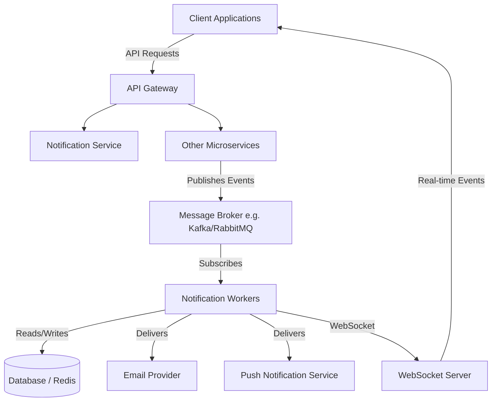

# Notification System Design

## 1. System Overview
The Notification System is designed to provide real-time updates and notifications across the application ecosystem. It acts as a centralized service that processes events from various services and delivers notifications to end-users via multiple channels (e.g., in-app, email, push notifications).

## 2. Architecture Diagram

## 3. Core Components

- **API Gateway**: Entry point for clients to fetch notification history or mark them as read.
- **Message Broker**: Decouples the notification generation from the delivery. Services publish events here.
- **Notification Workers**: Consumers that process events, apply user preferences, and format the messages.
- **Database**: Stores user preferences, notification history, and status (read/unread).
- **WebSocket Server**: Maintains persistent connections with active clients for real-time delivery.

## 4. Technologies
- **Backend Framework**: Node.js / Express
- **Database**: PostgreSQL for persistent data, Redis for caching active WebSocket connections.
- **Message Broker**: RabbitMQ or Apache Kafka
- **Frontend**: React.js with Vanilla CSS.

## 5. Failure Handling and Retries
- **Retry Logic**: Failed deliveries to third-party providers will be placed in a dead-letter queue (DLQ) and retried with exponential backoff.
- **Idempotency**: All notification events have a unique ID to prevent duplicate deliveries.
